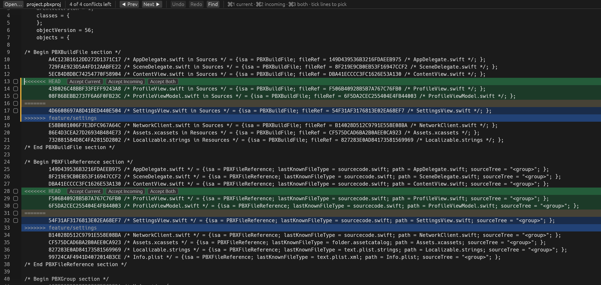
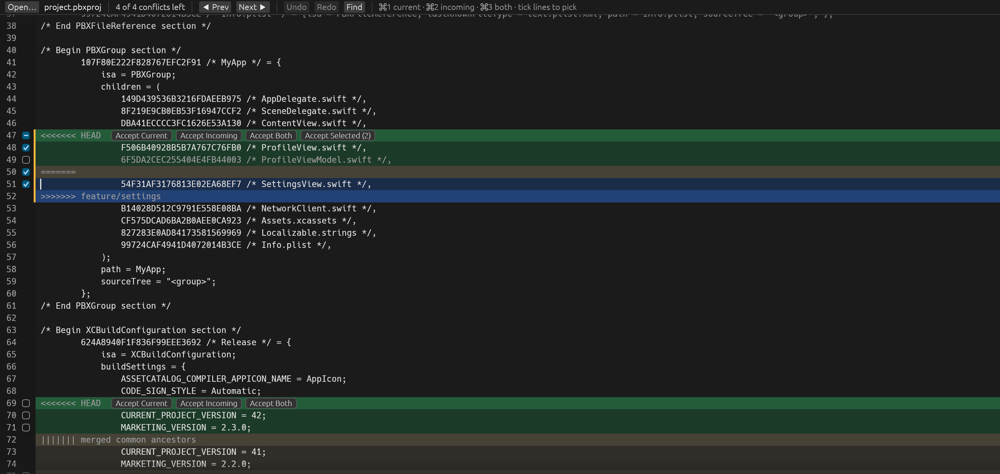
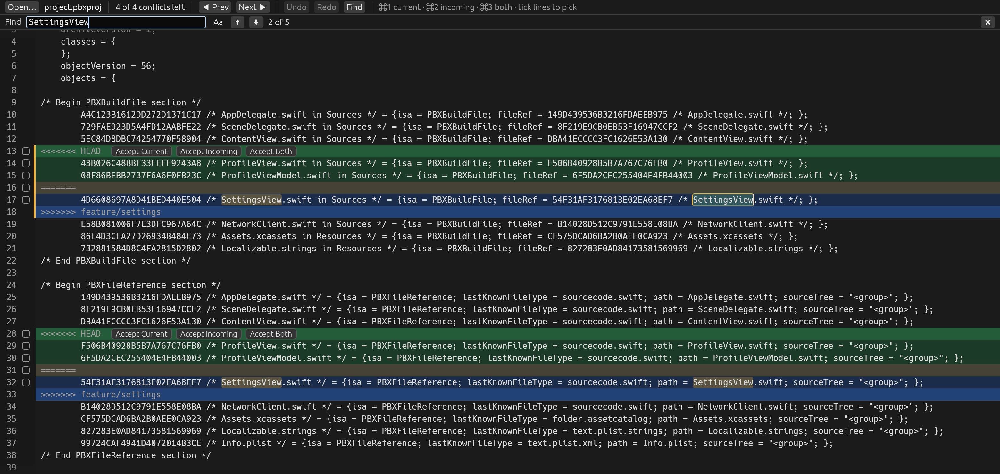

# mergefix

**mergefix is a small, fast desktop app for resolving Git merge conflicts on macOS and Linux.** It opens the conflicted file as a full text editor and highlights every conflict. Each conflict gets buttons to keep your side, their side, or both. You can also tick the exact lines you want, or fix the text by hand.

It was built for files that make other editors struggle, such as the `project.pbxproj` of a large iOS app. A 50 MB file with thousands of conflicts opens in about 15 ms, and each keystroke takes about 10 microseconds. The file saves itself as you work.



## Contents

- [Features](#features)
- [Install](#install)
- [Using mergefix](#using-mergefix)
- [Keyboard shortcuts](#keyboard-shortcuts)
- [Use it as your git mergetool](#use-it-as-your-git-mergetool)
- [Uninstall](#uninstall)
- [Troubleshooting](#troubleshooting)
- [Why it is fast](#why-it-is-fast)
- [Development](#development)

## Features

- **One-click resolution.** Accept Current, Accept Incoming or Accept Both on every conflict, or use a keyboard shortcut and jump to the next one.
- **Line picking.** Tick individual lines from either side and accept only those. For example, you can keep all of incoming plus one line of current.
- **A full editor.** Click anywhere and type, select, cut, copy, paste, undo and redo. Deleting a conflict's marker lines by hand resolves it, just as in VS Code.
- **Find.** Search the whole file, with match highlighting, a match counter and an optional match-case toggle.
- **diff3 support.** The common-ancestor section (`|||||||`) is shown and handled.
- **Safe saving.** Changes are written in the background shortly after each edit, using an atomic replace, so the file is never left half-written.
- **Works with git.** Exits with code `0` when no conflicts remain and `1` otherwise, so `git mergetool` knows whether the file is resolved.
- **Native on both platforms.** On macOS it is a regular app in `/Applications` with Finder "Open With" support. On Linux it appears in your applications menu and in your file manager's "Open With" list.

## Install

### Quick install (macOS and Linux)

Clone the repository and run the setup script:

```sh
git clone <repository-url> mergefix
cd mergefix
./setup.sh
```

The script installs whatever is missing, builds mergefix, and installs it. The first build takes one to two minutes. Run `./setup.sh` again at any time to update after pulling new changes.

| | macOS | Linux |
|---|---|---|
| Build tools | Asks to install the Xcode Command Line Tools if they are missing | Installs a C compiler, curl, and the graphics and keyboard libraries using `apt`, `dnf`, `pacman` or `zypper` (asks for your password) |
| Rust | Installs Rust with rustup if it is missing or older than 1.85 (user-local, in `~/.cargo`) | Same |
| App | `/Applications/mergefix.app`, which you can open from Spotlight, Launchpad or Finder | `~/.local/bin/mergefix`, plus a menu entry and icon in `~/.local/share` |
| Command | `mergefix`, linked from `~/.cargo/bin` | `mergefix`, in `~/.local/bin` |

Options:

```sh
./setup.sh --git-mergetool   # also make mergefix your git mergetool (see below)
./setup.sh --uninstall       # remove everything the script installed
./setup.sh --help
```

Supported systems: macOS on Apple Silicon or Intel. On Linux: Debian, Ubuntu, Fedora, Arch, openSUSE and their derivatives, on X11 or Wayland.

### Manual install

<details>
<summary>macOS</summary>

1. Install the Xcode Command Line Tools: `xcode-select --install`
2. Install Rust 1.85 or newer from [rustup.rs](https://rustup.rs).
3. Build the app, copy it to `/Applications`, and link the `mergefix` command:

   ```sh
   ./macos/bundle.sh --install
   ```

   Without `--install`, it only builds `target/bundle.noindex/mergefix.app`.

</details>

<details>
<summary>Linux</summary>

1. Install a C compiler and the runtime libraries. On Debian or Ubuntu:

   ```sh
   sudo apt install build-essential curl libxkbcommon-x11-0 libegl1 libgl1 libwayland-client0
   ```

2. Install Rust 1.85 or newer from [rustup.rs](https://rustup.rs).
3. Build and install the command:

   ```sh
   cargo install --path .
   ```

   This puts `mergefix` in `~/.cargo/bin`. It does not add a menu entry; `./setup.sh` does that.

</details>

## Using mergefix

Open a file in any of these ways:

- Run `mergefix path/to/file` in a terminal.
- Click **Open...** in the toolbar (`⌘O` on macOS, `Ctrl+O` on Linux).
- Drop the file onto the window, or onto the Dock icon on macOS.
- Right-click the file in Finder or your file manager and choose **Open With > mergefix**.

### Resolve conflicts

Conflicts are highlighted in color:

- **Green:** the current side ("ours", your branch).
- **Blue:** the incoming side ("theirs").
- **Tan:** the common ancestor, when the file uses diff3 style.

Each conflict's first line has **Accept Current**, **Accept Incoming** and **Accept Both** buttons. The toolbar shows how many conflicts are left, and **Prev** / **Next** jump between them.

You are never limited to the buttons, because the window is a normal text editor. Type anywhere to fix what you need, such as a missing bracket or a line combined from both sides. Conflicts are detected live, so deleting a conflict's `<<<<<<<`, `=======` and `>>>>>>>` lines yourself also resolves it.

### Keep only some lines

To keep only some lines of a conflict, tick their checkboxes in the gutter. Then click **Accept Selected (n)**, which appears next to the other buttons. The checkbox on the `<<<<<<<` line ticks or unticks every current line, and the one on the `=======` line does the same for every incoming line. Picked lines keep their order in the file.



### Find

Press `⌘F` on macOS or `Ctrl+F` on Linux, or click **Find**. If text is selected, the search starts with it. Matches are highlighted as you type, and the current match has an outline. The counter shows its position, for example "2 of 5". Press Enter to go to the next match and Shift+Enter for the previous one. **Aa** turns on match case. Esc closes the bar, and the match stays selected so you can type over it.



### Saving and undo

There is no Save button to remember. Every change is written to disk about 300 ms after you stop typing, and once more when you quit. All changes, including the Accept buttons, share one undo history.

To throw away your changes and start again from the original conflicted file, run `git checkout -m <file>`.

## Keyboard shortcuts

| Action | macOS | Linux |
|---|---|---|
| Accept current / incoming / both, then go to the next conflict | `⌘1` / `⌘2` / `⌘3` | `Ctrl+1` / `Ctrl+2` / `Ctrl+3` |
| Next conflict | `⌥↓` or `F7` | `Alt+Down` or `F7` |
| Previous conflict | `⌥↑` or `Shift+F7` | `Alt+Up` or `Shift+F7` |
| Undo | `⌘Z` | `Ctrl+Z` |
| Redo | `⇧⌘Z` or `⌘Y` | `Ctrl+Shift+Z` or `Ctrl+Y` |
| Find | `⌘F` | `Ctrl+F` |
| Next / previous match | `⌘G` / `⇧⌘G`, or Enter / Shift+Enter in the find bar | `Ctrl+G` / `Ctrl+Shift+G`, or Enter / Shift+Enter in the find bar |
| Open a file | `⌘O` | `Ctrl+O` |
| Save now (normally automatic) | `⌘S` | `Ctrl+S` |
| Move by word | `⌥←` / `⌥→` | `Ctrl+Left` / `Ctrl+Right` |
| Start / end of line | `⌘←` / `⌘→`, or Home / End | Home / End |
| Start / end of file | `⌘↑` / `⌘↓` | `Ctrl+Up` / `Ctrl+Down` |

The accept shortcuts act on the conflict under the cursor. If the cursor is not in a conflict, they act on the one marked with the orange bar. The usual editing keys also work: Shift to extend a selection, select all, cut, copy, paste and Tab. Enter keeps the current line's indentation. Double-click selects a word, and triple-click selects a line.

## Use it as your git mergetool

Run `./setup.sh --git-mergetool`, or set it up by hand:

```sh
git config --global mergetool.mergefix.cmd 'mergefix "$MERGED"'
git config --global mergetool.mergefix.trustExitCode true
git config --global merge.tool mergefix
```

Then, during a merge or rebase that stops on conflicts:

```sh
git mergetool
```

Git opens each conflicted file in mergefix in turn. When you close the window, git marks the file as resolved only if no conflicts remain.

## Uninstall

```sh
./setup.sh --uninstall
```

This removes the app, the `mergefix` command, the Linux menu entry and icon, and the git mergetool settings. Rust is left installed; remove it with `rustup self uninstall` if you no longer need it.

## Troubleshooting

**`mergefix: command not found` right after installing.** Open a new terminal window. If it still fails, add the folder to your PATH: `~/.cargo/bin` on macOS or `~/.local/bin` on Linux.

**Linux: there is no Open... button.** mergefix uses your desktop's own file picker, through `zenity` or `kdialog`. Install either one, for example `sudo apt install zenity`. Until then, open files from the terminal, by drag and drop, or with your file manager's Open With.

**Linux: the window does not open and reports a missing library.** Run `./setup.sh` again, or install your distribution's packages for `libxkbcommon-x11`, Mesa EGL/GL and the Wayland client library.

**macOS: mergefix shows up twice in Spotlight.** Older versions of the build script left a second copy in `target/release`. Run `./setup.sh` again; it builds into a folder that Spotlight ignores.

**The file contains invalid UTF-8.** mergefix still opens it and shows a warning in the toolbar. Invalid bytes are replaced when the file is saved.

## Why it is fast

- The text is stored in a rope (`ropey`), so an edit anywhere in a 50 MB file costs microseconds. The background saver gets an instant snapshot instead of a copy.
- Conflicts are found at load time with a SIMD newline scan (`memchr`). After each edit, only the lines around the change are scanned again.
- Only the lines on screen are laid out and drawn each frame.
- Find uses SIMD substring search and counts matches on a background thread. A 41 MB file is searched in 2 to 20 ms, depending on how many matches there are.
- Saves wait for a 300 ms pause, so typing does not rewrite a huge file on every key.
- The UI uses egui with the OpenGL backend. The binary is small, startup is quick, and the app uses no CPU while idle.

Benchmark on Apple Silicon, with a 49 MB file of 404,000 lines and 2,000 conflicts:

```
load 15 ms | keystroke 10 µs | resolve 90 µs each | save 1.8 ms
```

Run it yourself with `cargo test --release bench -- --ignored --nocapture`.

## Development

```sh
cargo run --release -- path/to/file   # run without installing
cargo test --release                  # unit tests
```

| Path | Contents |
|---|---|
| `src/main.rs` | Startup: argument parsing, loading the file while the window opens, exit code |
| `src/app.rs` | The editor UI: rendering, input, toolbar, find bar |
| `src/doc.rs` | The document: rope storage, conflict detection, edits, undo and redo, saving |
| `src/find.rs` | Search |
| `src/platform.rs` | OS integration: macOS Finder open events, Open dialogs |
| `macos/` | `Info.plist` and the script that builds `mergefix.app` |
| `setup.sh` | The installer for macOS and Linux |
